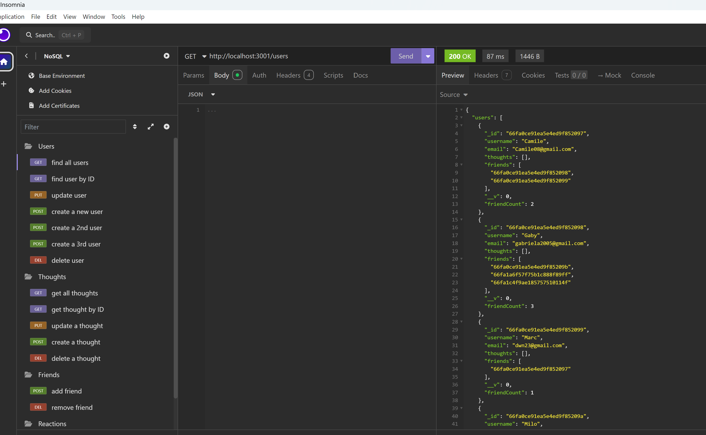
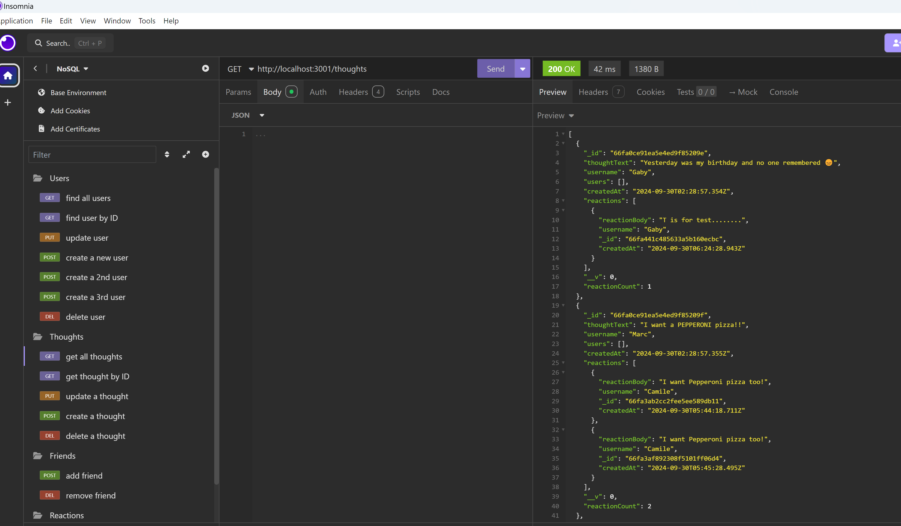
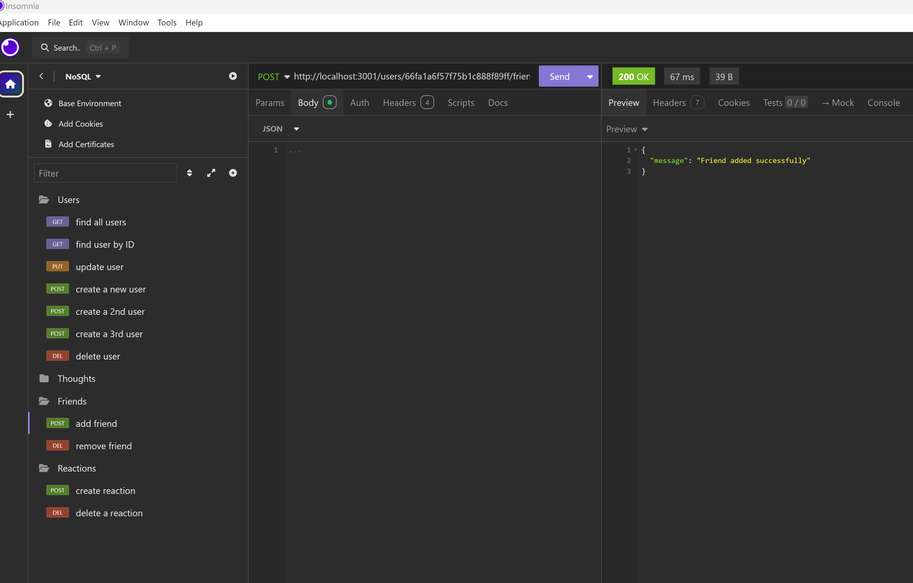
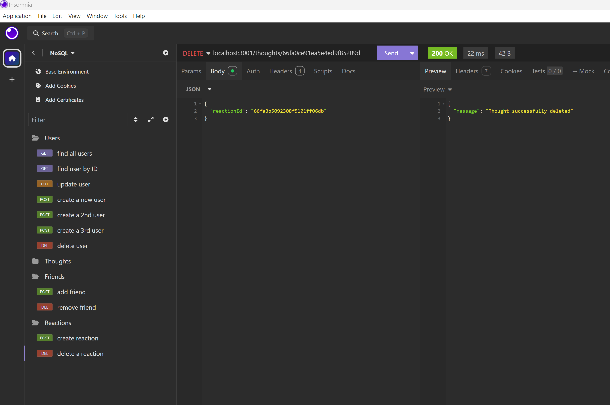

# Social Network API    

## Table of Contents      
  
- [Description](#description)
- [Features](#features)
- [Technologies Used](#technologies-used)
- [Steps](#steps)
- [Testing](#testing)
- [Repository Link](#repository-link)
- [Walkthrough Video Link](#walkthrough-video-link)
- [Application Screenshots](#application-screenshot)
- [License](#license)  

## Description  

This API was built for a social network application where users can share their thoughts, react to friends thoughts, and create a friends list. Using Express.js for routing, a MondoDB database, and the Mongoose ODM.

## Features  
* User authentication and management  
* Add and remove friends  
* Create, read, upate and delete thoughts  
* Add and remove reactions to thoughts    

## Installation note    

Please ensure to have the following dependencies installed:    
`Express.js`   
`MongoDB (Mongoose)`  
`Insomnia`   

## Steps 
1. npm i  
2. Mongod  
3. npm run seed  
4. npm start  
9. Use Insomnia to see it in action      

## Testing  
Use Insomnia to test the API endpoints. Ensure the server is running before making requests.

##  Repository link    

https://github.com/ssoto83/NoSQL.git  

## Walkthrough video link

https://drive.google.com/file/d/1e9YCA-bHJk2fc7zlBff5BddWaQj_GFH_/view?usp=sharing

## Application screenshots   

    
  
  
    

## License
This project is licensed under the MIT License.